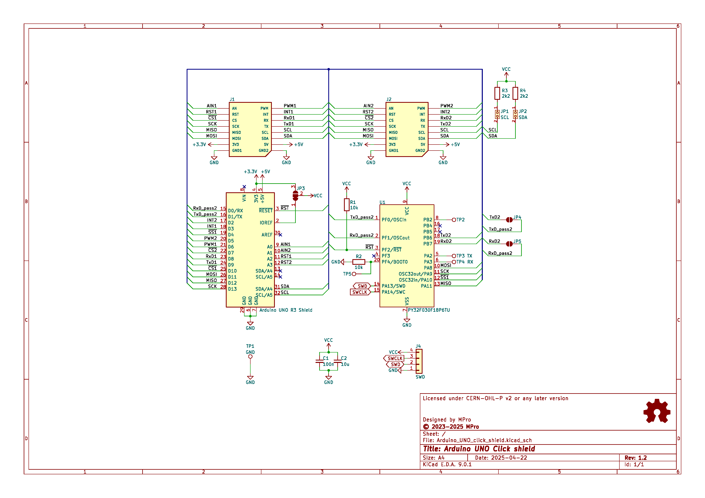
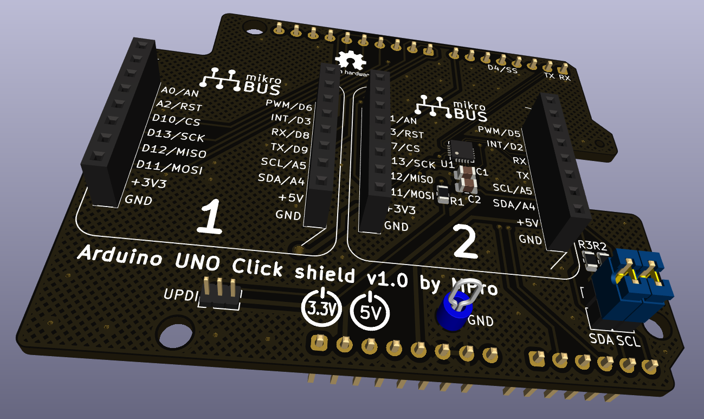

# **Arduino UNO Click Shield**

- [**Arduino UNO Click Shield**](#arduino-uno-click-shield)
  - [**Overview**](#overview)
    - [**Supported boards**](#supported-boards)
    - [**Features**](#features)
    - [**Configuration Jumpers**](#configuration-jumpers)
      - [**JP3: VCC Selection**](#jp3-vcc-selection)
      - [**JP1 and JP2: I²C Configuration**](#jp1-and-jp2-ic-configuration)
      - [**JP4 and JP5: UART Configuration**](#jp4-and-jp5-uart-configuration)
  - [**Schematic diagram**](#schematic-diagram)
  - [**Module visualisation**](#module-visualisation)
  - [**Assembly**](#assembly)
  - [**Production files**](#production-files)
  - [**Reporting bugs**](#reporting-bugs)
  - [**License**](#license)
    - [**Hardware**](#hardware)
    - [**Software**](#software)
  - [**Support**](#support)

---

## **Overview**
The Arduino UNO Click Shield is an extension board designed for the Arduino UNO, enhancing its capabilities by providing a mikroBUS™ socket for connecting Click boards. Additionally, it integrates an onboard PY32F030F18P6TU microcontroller, whose task is to provide SPI to UART conversion for MikroBUS™ slot 2. This shield is ideal for hobbyists, engineers, and developers looking to expand the Arduino ecosystem with modular add-ons.

### **Supported boards**
  * **Arduino UNO** boards and clones as well as other boards compatible with the Arduino UNO R3 standard.

### **Features**
* **mikroBUS™ Socket**: Facilitates the connection of Click boards, supporting interfaces such as SPI, I²C, UART, analog, PWM, and interrupt signals.
* **Onboard PY32F030F18P6TU Microcontroller**: Features an PY32F030F18P6TU (ARM Cortex-M0, 32-bit), whose task is to provide SPI to UART conversion for MikroBUS™ slot 2.
* **Voltage Selection**: A 3-pole solder jumper (JP3) enables selection between the Arduino's IOREF voltage (typically 5V) and 3.3V for powering the Click board.
* **I²C Configuration Jumpers**: Two 2-pin jumpers (JP1 and JP2) enables the 2.2kΩ pull-up resistor on SDA and SCL.
* **SWD Connector**: A 4-pin connector (J4) for programming and debugging the onboard PY32F030 microcontroller.

---

### **Configuration Jumpers**
#### **JP3: VCC Selection**
JP3 is a 3-pole solder jumper that determines the supply voltage for the Click board's VCC pin.
* Default (Pins 1-2 Bridged): VCC connects to the Arduino's IOREF pin, typically 5V on the Arduino UNO.
* Alternative (Pins 2-3 Bridged): VCC connects to the 3.3V supply from the Arduino.
Select the appropriate configuration based on the voltage requirements of the Click board in use.
#### **JP1 and JP2: I²C Configuration**
* Enables the 2.2kΩ pull-up resistor on SDA and SCL when closed.
#### **JP4 and JP5: UART Configuration**
* Soldered jumpers, bypassing the PY32F030 chip and allowing direct transmission of Arduino RX and TX signals to the mikroBUS™ socket #2.

---

## **Schematic diagram**

## **Module visualisation**
(click on the image to see the 3D model)

## **Assembly**
[Interactive BOM and placement](https://michpro.github.io/mikroBUS/Arduino_UNO_click_shield/docs/ibom.html)

## **Production files**
Production files can be found [**here**](./production/).

---

## **Reporting bugs**

[Create an issue on GitHub](https://github.com/michpro/mikroBUS/issues)

---

## **License**
Copyright © 2023-2025 Michal Protasowicki

### **Hardware**
  * Hardware part of this project is released under CERN Open Hardware Licence Version 2 - Permissive.

    

### **Software**
  * Software part of this project is released under MIT Licence.

    

---

## **Support**
If You find my projects interesting and You wanted to support my work, You can give me a cup of coffee or a keg of beer :)

&nbsp;&nbsp;&nbsp;&nbsp;&nbsp;&nbsp;&nbsp;&nbsp;&nbsp;&nbsp;
