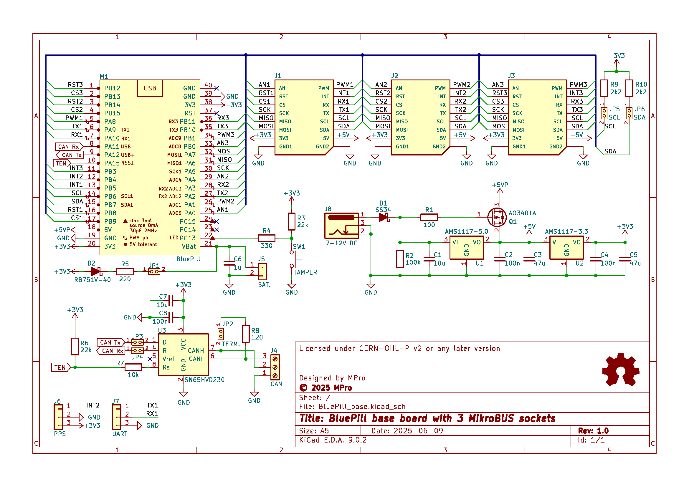
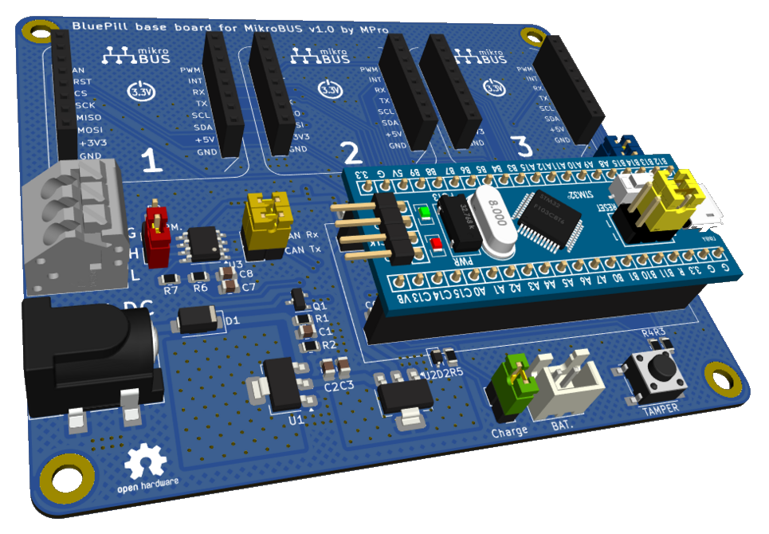

# **BluePill Base Board with 3 MikroBUS™ Sockets**

- [**BluePill Base Board with 3 MikroBUS™ Sockets**](#bluepill-base-board-with-3-mikrobus-sockets)
  - [**Overview**](#overview)
    - [**Supported boards**](#supported-boards)
    - [**Features**](#features)
  - [**Detailed Description**](#detailed-description)
    - [**Microcontroller Connection**](#microcontroller-connection)
    - [**MikroBUS™ Sockets**](#mikrobus-sockets)
    - [**Communication Interfaces**](#communication-interfaces)
    - [**Configuration Jumpers**](#configuration-jumpers)
  - [**Schematic diagram**](#schematic-diagram)
  - [**Module visualisation**](#module-visualisation)
  - [**Assembly**](#assembly)
  - [**Production files**](#production-files)
  - [**Programming and Operation:**](#programming-and-operation)
  - [**Reporting bugs**](#reporting-bugs)
  - [**License**](#license)
  - [**Support**](#support)

---

## **Overview**
The BluePill Base Board is a versatile platform designed to extend the functionality of the BluePill microcontroller development board. This base board enhances the BluePill's capabilities by incorporating three MikroBUS™ sockets, enabling seamless integration of various MikroBUS™-compatible add-on modules such as sensors, communication interfaces, and other peripherals. It is an ideal solution for prototyping and developing embedded systems and IoT applications.

### **Supported boards**
  * **Standard BluePill** boards and clones with STM32F103 or STM32F072 µC
  * **BluePill Plus** with GD32F303CCT6 ARM M4F µC - [https://github.com/WeActStudio/BluePill-Plus](https://github.com/WeActStudio/BluePill-Plus)
  * **BluePill Plus CH32** with CH32V103C8T6 or CH32V203C8T6 RISV-V µC - [https://github.com/WeActStudio/WeActStudio.BluePill-Plus-CH32](https://github.com/WeActStudio/WeActStudio.BluePill-Plus-CH32)

### **Features**
* **Power Supply**:
  * Input via a standard barrel jack connector with reverse polarity protection.
  * Battery input for RTC clock via JST XH connector, with recharge option.
  * Power switch controlled by a P-channel MOSFET (*External power supply priority over USB for the +5V line*).
* **Voltage Regulation**:
  * 3.3V linear regulator (AMS1117-3.3) for the microcontroller and peripherals.
  * 5V power rail available for additional components and MikroBUS™ modules.
* **Connectors**:
  * Socket for the BluePill microcontroller board.
  * Three MikroBUS™ sockets for add-on modules.
  * UART header for serial communication (PA9/PA10 shared with the first MikroBUS™ socket).
  * CAN bus terminal block (PA11/PA12 shared with USB on the BluePill board).
* **Communication Interfaces**:
  * SPI, I²C, UART, and PWM support via MikroBUS™ sockets.
  * CAN bus interface using the SN65HVD230 transceiver.

---

## **Detailed Description**

### **Microcontroller Connection**
* **Socket**: The BluePill board connects via a 2x20 pin socket (M1), providing access to power (3.3V, 5V, GND) and all I/O pins.
* **Pin Mapping**: The socket interfaces with MikroBUS™ sockets and other peripherals, with specific pins allocated for SPI, I2C, UART, and CAN communication. 

  | Name | Socket 1 | Socket 2 | Socket 3 | Board | Notes |
  | :--- | :------: | :------: | :------: | :---: | :---- |
  | AN     | PA0  | PA4  | PB0  | | SPI0 NSS output Disabled (PA4) |
  | RST    | PB8  | PB14 | PB12 | | |
  | CS     | PB9  | PB15 | PB13 | | |
  | SCK    | PA5  | PA5  | PA5  | | |
  | MISO   | PA6  | PA6  | PA6  | | |
  | MOSI   | PA7  | PA7  | PA7  | | |
  | PWM    | PA8  | PA1  | PB1  | | |
  | INT    | PB5  | PB4  | PB3  | | JTAG-DP must be Disabled (PB3 & PB4) |
  | RX     | PA10 | PA3  | PB11 | PA10 | Shared between Board and Socket 1 |
  | TX     | PA9  | PA2  | PB10 | PA9  | Shared between Board and Socket 1 |
  | SCL    | PB6  | PB6  | PB6  | | |
  | SDA    | PB7  | PB7  | PB7  | | |
  | CAN Tx |      |      |      | PA12 | Shared with BluePill USB- |
  | CAN Rx |      |      |      | PA11 | Shared with BluePill USB+ |
  | CAN EN |      |      |      | PA15 | JTAG-DP must be Disabled |

### **MikroBUS™ Sockets**
* **Configuration**: Three MikroBUS™ sockets (J1, J2, J3) are implemented using dual 1x8 pin headers, adhering to the MikroBUS™ standard.
* **Pinout**:
  * **Power**: +3.3V, +5V, GND
  * **SPI**: MOSI, MISO, SCK, CS
  * **I2C**: SDA, SCL
  * **UART**: TX, RX
  * **Other**: PWM, Analog Input (AN), Interrupt (INT), Reset (RST)
* **Usage**: Each socket supports independent module connections, with signals routed to the BluePill's corresponding pins.

### **Communication Interfaces**
* **SPI**: Shared across MikroBUS™ sockets with individual chip select (CS) lines (CS1, CS2, CS3).
* **I2C**: SDA and SCL lines connected to the BluePill, configurable via jumpers (JP5, JP6).
* **UART**: Accessible via a 3-pin header (J7) and MikroBUS™ sockets (TX1/RX1, TX2/RX2, TX3/RX3).
* **CAN Bus**: Implemented with the SN65HVD230 transceiver (U3), connected to a 3-pin terminal block (J4) for CANH and CANL lines.
* **PWM**: Available on MikroBUS™ sockets (PWM1, PWM2, PWM3).

### **Configuration Jumpers**
* **JP1**: [Charge] If shorted, it supplies a small current through D2 and R5 to recharge the RTC clock battery/supercapacitor.
* **JP2**: [TERM] If shorted, it terminates the CAN bus with a 120Ω resistor..
* **JP3**: [CAN Tx] If shorted, it transmits the CAN Tx signal to the SN65HVD230 transceiver.
* **JP4**: [CAN Rx] If shorted, it transmits the CAN Rx signal from the SN65HVD230 transceiver.
* **JP5**: [SCL] If shorted, connects a pull-up resistor for the I²C bus to the line.
* **JP6**: [SDA] If shorted, connects a pull-up resistor for the I²C bus to the line.

---

## **Schematic diagram**

## **Module visualisation**
(click on the image to see the 3D model)

## **Assembly**
[Interactive BOM and placement](https://michpro.github.io/mikroBUS/BluePill_base/docs/ibom.html)

## **Production files**
Production files can be found [**here**](./production/).

## **Programming and Operation:**
  * Program the BluePill using an external programmer (e.g., via SWD pins).
  * Utilize the MikroBUS™ modules and UART/CAN interfaces as required.

---

## **Reporting bugs**

[Create an issue on GitHub](https://github.com/michpro/mikroBUS/issues)

---

## **License**
Copyright © 2025 Michal Protasowicki

This project is released under CERN Open Hardware Licence Version 2 - Permissive.

---

## **Support**
If You find my projects interesting and You wanted to support my work, You can give me a cup of coffee or a keg of beer :)

&nbsp;&nbsp;&nbsp;&nbsp;&nbsp;&nbsp;&nbsp;&nbsp;&nbsp;&nbsp;
