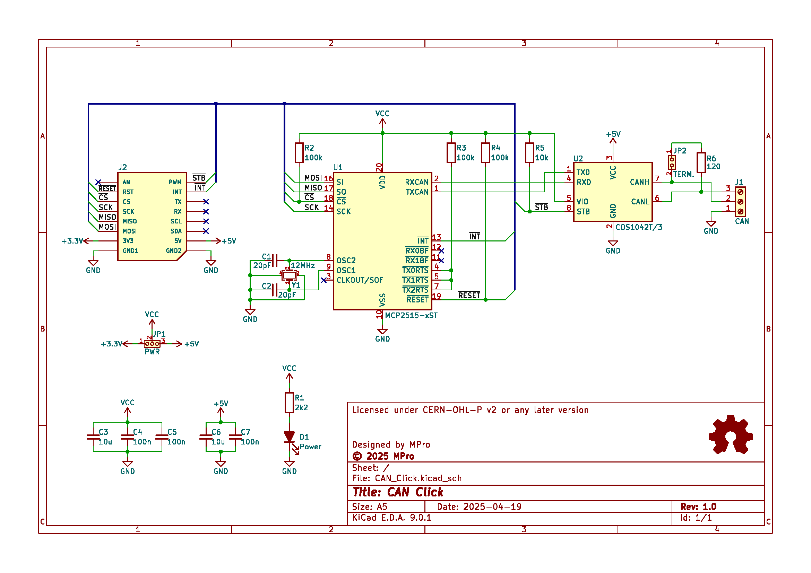
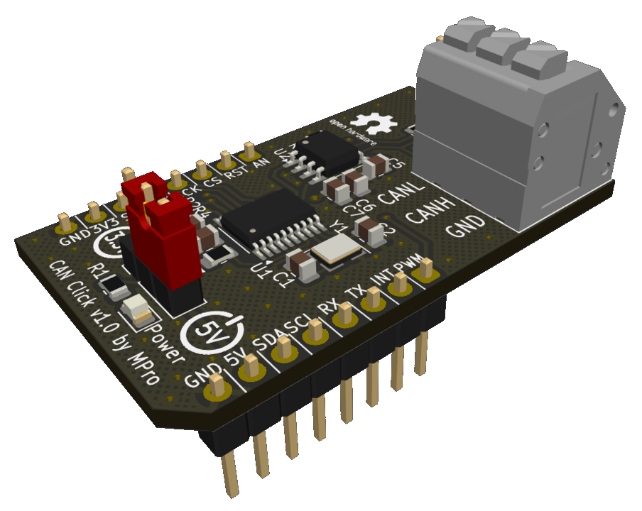

# **CAN Click**

- [**CAN Click**](#can-click)
  - [**Overview**](#overview)
    - [**Features**](#features)
  - [**Schematic diagram**](#schematic-diagram)
  - [**Module visualisation**](#module-visualisation)
  - [**Assembly**](#assembly)
  - [**Production files**](#production-files)
  - [**Testing out the hardware**](#testing-out-the-hardware)
    - [1. Hardware Setup](#1-hardware-setup)
      - [MikroBUS™ Slot Configuration](#mikrobus-slot-configuration)
      - [CAN Bus Connection](#can-bus-connection)
      - [Additional Notes](#additional-notes)
    - [2. Software Setup](#2-software-setup)
      - [Prerequisites](#prerequisites)
      - [Library Installation](#library-installation)
      - [Code Upload](#code-upload)
      - [Serial Monitor](#serial-monitor)
      - [Additional Notes](#additional-notes-1)
    - [3. Operation](#3-operation)
      - [CAN Initialization](#can-initialization)
      - [Message Transmission](#message-transmission)
      - [Message Reception](#message-reception)
    - [4. Additional Notes](#4-additional-notes)
      - [CAN Configuration](#can-configuration)
      - [Troubleshooting](#troubleshooting)
  - [**Reporting bugs**](#reporting-bugs)
  - [**License**](#license)
    - [**Hardware**](#hardware)
    - [**Software**](#software)
  - [**Support**](#support)

---

## **Overview**
The CAN Click is a compact add-on board designed to integrate Controller Area Network (CAN) bus communication into microcontroller-based systems. It adheres to the mikroBUS™ standard, enabling seamless connection to any host board with a mikroBUS™ socket. The board features the MCP2515 standalone CAN controller and the COS1042T/3 high-speed CAN transceiver, providing a robust and reliable CAN bus interface.

### **Features**
* **CAN Controller**: MCP2515 with SPI interface for communication with the host microcontroller.
* **CAN Transceiver**: COS1042T/3 supporting high-speed CAN communication.
* **Crystal Oscillator**: 12 MHz crystal for precise timing of the MCP2515.
* **Power Supply**: Configurable for 3.3V or 5V operation via jumper (JP1).
* **Interfaces**: SPI communication lines, interrupt pin (INT), and reset pin (RST) via mikroBUS™; CAN bus connection via a 3-position spring terminal.
* **Indicators**: Power/activity LED (D1).
* **Termination**: Optional CAN bus termination resistor (120Ω) via jumper (JP2).

---

## **Schematic diagram**
<p align="center"></p>


## **Module visualisation**
(click on the image to see the 3D model)
<p align="center"><a href="https://3dviewer.net/#model=https://github.com/michpro/mikroBUS/blob/master/CAN_Click/docs/CAN_Click.wrl"></a></p>

## **Assembly**
[Interactive BOM and placement](https://michpro.github.io/mikroBUS/CAN_Click/docs/ibom.html)

## **Production files**
Production files can be found [**here**](./production/).

---

## **Testing out the hardware**
Below are step-by-step instructions to set up and run the provided Arduino UNO code [test_sw.ino](./test_sw/test_sw.ino) for bidirectional CAN bus communication using the MCP2515 module. The code enables periodic transmission of a 3-byte counter message with an extended CAN ID (0x0BB0DEEF) at 1000 kbps and simultaneous reception of incoming CAN messages, both logged to the serial monitor.

### 1. Hardware Setup

#### MikroBUS™ Slot Configuration
The code supports two MikroBUS™ slot configurations for connecting the MCP2515 CAN bus module to the Arduino UNO.<br>Select one slot and connect the module to the corresponding pins:

* **MOSI**: Pin 11
* **MISO**: Pin 12
* **SCK**: Pin 13
* **For Slot 1** (default, `MIKROBUS_SLOT` set to `1`):
  * **SPI Chip Select (CS)**: Pin 10
  * **CAN Interrupt (INT)**: Pin 3
  * **CAN Standby**: Pin 6

* **For Slot 2** (modify `MIKROBUS_SLOT` to `2` in the code):
  * **SPI Chip Select (CS)**: Pin 7
  * **CAN Interrupt (INT)**: Pin 2
  * **CAN Standby**: Pin 5
  
You can also use the [Arduino UNO Click Shield](../Arduino_UNO_click_shield/README.md) or [BluePill Base Board](../BluePill_base/README.md) for the connection.

#### CAN Bus Connection
* Connect the MCP2515 module’s CAN_H and CAN_L pins to the CAN bus.
* Ensure the CAN bus is properly terminated with 120Ω resistors at both ends.
* Connect the CAN bus to another CAN device configured to operate at 1000 kbps and capable of handling extended CAN IDs.

#### Additional Notes
* Verify all connections (SPI: MOSI, MISO, SCK; power: 5V, GND) between the Arduino UNO and the MCP2515 module are secure.

---

### 2. Software Setup

#### Prerequisites
* Use an Arduino board with AVR architecture (e.g., Arduino UNO), as the code includes a check (`ARDUINO_ARCH_AVR`) to enforce this.

#### Library Installation
By default, all additional libraries are provided with the program and placed in the `src` folder of the project.
* **`mcp2515_can`**: For CAN bus communication with the MCP2515 module.
  * Available via the [Arduino Library](https://docs.arduino.cc/libraries/can_bus_shield/) Manager or [GitHub](https://github.com/Seeed-Studio/Seeed_Arduino_CAN).
* **`SimplestTimer`**: For timing the periodic message transmissions.

#### Code Upload
1. Open the provided `test_sw.ino` file in the Arduino IDE.
2. Verify the `MIKROBUS_SLOT` definition (`1` or `2`) matches your hardware configuration.
3. Upload the code to the Arduino UNO.

#### Serial Monitor
* Open the Arduino IDE’s Serial Monitor.
* Set the baud rate to **115200** to view the output.

#### Additional Notes
* The libraries used in this project are marked as independent of the µC architecture, so after removing the guard and adjusting the pin mapping, you can try to run this software on µCs other than AVR, e.g. on STM32.

---

### 3. Operation

#### CAN Initialization
* Upon startup, the code initializes the MCP2515 module at **1000 kbps** with a 12 MHz clock (`MCP_12MHz`).
* If initialization fails, the serial monitor displays `"CAN init fail, retry..."` and retries every second until successful.
* Once initialized, `"CAN init OK!"` is printed.

#### Message Transmission
* Every **2.5 seconds** (`CAN_MSG_SEND_PERIOD = 2500ms`), the Arduino sends a 3-byte CAN message:
  * **CAN ID**: `0x0BB0DEEF` (extended ID format).
  * **Data**: A 24-bit counter (`txCounter`) split into three bytes (MSB to LSB), incrementing with each transmission.
* Successful transmissions are logged to the serial monitor in the format:
  ```
  TX ID: 0x0BB0DEEF  data: 0x00 0x00 0x01
  ```

#### Message Reception
* The Arduino continuously checks for incoming CAN messages.
* Received messages are logged to the serial monitor with their CAN ID and data in hexadecimal format, e.g.:
  ```
  RX ID: 0x12345678  data: 0xAA 0xBB 0xCC
  ```
* If a message has no data, only the ID is printed.

---

### 4. Additional Notes

#### CAN Configuration
* **Speed**: 1000 kbps (`CAN_1000KBPS`).
* **ID Type**: Extended IDs (`CAN_EXTENDED_ID = 1`).
* **Frame Format**: Data Frame (`CAN_STANDARD_FRAME = 0`).
* Ensure the connected CAN device matches these settings.

#### Troubleshooting
* **No Output**: Check Serial Monitor baud rate (115200), library installation, and hardware connections.
* **CAN Init Fails**: Verify pin connections, power supply, and CAN bus termination.
* **No Communication**: Confirm the other CAN device is operational and configured correctly.

---

*By following these instructions, you should successfully set up and run the CAN bus test project on your Arduino UNO with the mikroBUS™ CAN Click. The system will transmit an incrementing counter every 2.5 seconds and display both sent and received messages on the serial monitor.*

---

## **Reporting bugs**

[Create an issue on GitHub](https://github.com/michpro/mikroBUS/issues)

---

## **License**
Copyright © 2025 Michal Protasowicki

### **Hardware**
  * Hardware part of this project is released under CERN Open Hardware Licence Version 2 - Permissive.

    [](../LICENSE)

### **Software**
  * Software part of this project is released under MIT Licence.

    [](./test_sw/LICENSE)

---

## **Support**
If You find my projects interesting and You wanted to support my work, You can give me a cup of coffee or a keg of beer :)

[](https://www.paypal.me/michpro)&nbsp;&nbsp;&nbsp;&nbsp;&nbsp;[](https://ko-fi.com/F1F24CEW1)&nbsp;&nbsp;&nbsp;&nbsp;&nbsp;[](https://commerce.coinbase.com/checkout/ec299320-cbed-475d-976e-fdf37c1ac3d0)
