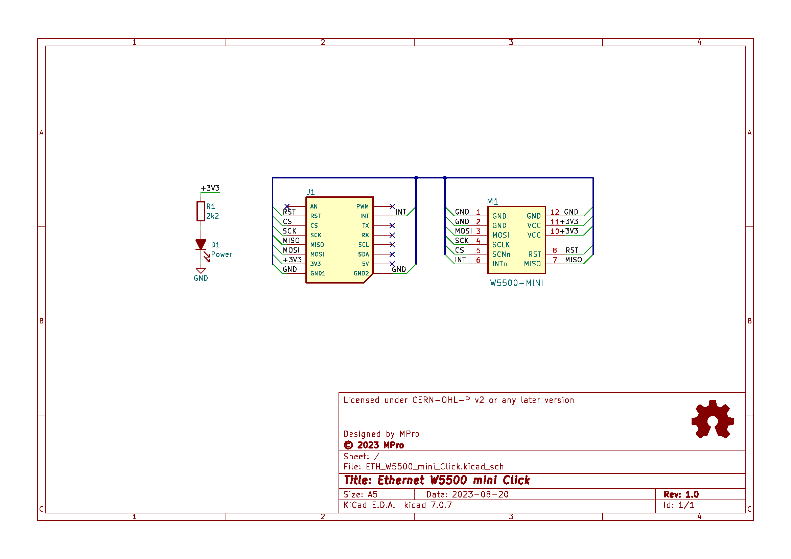
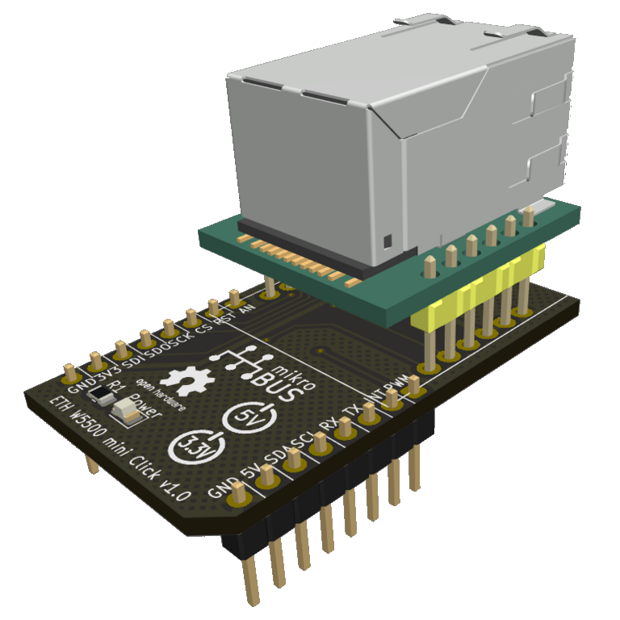

# **Ethernet W5500 mini Click**

- [**Ethernet W5500 mini Click**](#ethernet-w5500-mini-click)
  - [**Overview**](#overview)
    - [**Features**](#features)
  - [**Hardware Description**](#hardware-description)
  - [**Schematic diagram**](#schematic-diagram)
  - [**Module visualisation**](#module-visualisation)
  - [**Assembly**](#assembly)
  - [**Production files**](#production-files)
  - [**Reporting bugs**](#reporting-bugs)
  - [**License**](#license)
  - [**Support**](#support)

---

## **Overview**
The Ethernet W5500 mini Click is a compact Ethernet module designed to add wired network connectivity to microcontroller projects. The board supports standard SPI communication protocols and can be integrated into projects requiring network connectivity, such as IoT devices or embedded systems. It is based on the W5500 Ethernet controller chip and is compatible with the mikroBUS™ standard, making it easy to integrate with a wide range of development boards.

### **Features**
* **Ethernet Connectivity**: Provides a 10/100 Mbps Ethernet interface.
* **W5500 Controller**: Utilizes the W5500 chip for reliable and efficient network communication.
* **mikroBUS™ Compatibility**: Designed to fit the mikroBUS™ socket, ensuring compatibility with numerous development boards.
* **Compact Size**: Small form factor for space-constrained applications.
* **Power Indicator**: Includes an LED to indicate power status.
* **5V tolerance**: The I/O pins of the W5500 chip tolerate 5V logic levels, so this Click can operate in both +3.3V and +5V systems.

---

## **Hardware Description**
The Ethernet W5500 mini Click board consists of the following main components:
* **[W5500-MINI Module](https://www.makerfabs.com/mini-ethernet-board-w5500.html) (M1)**: A pre-assembled module that includes the W5500 Ethernet controller chip, magnetics, and an RJ45 connector. This module simplifies the design by integrating all necessary components for Ethernet communication.
* **mikroBUS™ Connector (J1)**: A standardized connector that allows the board to be plugged into any development board with a mikroBUS™ socket. It provides power and communication lines.
* **Power LED (D1)**: A yellow LED that lights up when the board is powered, indicating that the board is receiving power.
* **Current Limiting Resistor (R1)**: A 2.2kΩ resistor connected in series with the power LED to limit the current and prevent damage to the LED.

The W5500-MINI module is connected to the mikroBUS™ connector via SPI lines (MOSI, MISO, SCK, CS) and additional control lines (RST, INT). Power (+3.3V) and ground connections are also made through the mikroBUS™ connector.

---

## **Schematic diagram**

## **Module visualisation**
(click on the image to see the 3D model)

## **Assembly**
[Interactive BOM and placement](https://michpro.github.io/mikroBUS/ETH_W5500_mini_Click/docs/ibom.html)

## **Production files**
Production files can be found [**here**](./production/).

---

## **Reporting bugs**

[Create an issue on GitHub](https://github.com/michpro/mikroBUS/issues)

---

## **License**
Copyright © 2023-2025 Michal Protasowicki

This project is released under CERN Open Hardware Licence Version 2 - Permissive.

---

## **Support**
If You find my projects interesting and You wanted to support my work, You can give me a cup of coffee or a keg of beer :)

&nbsp;&nbsp;&nbsp;&nbsp;&nbsp;&nbsp;&nbsp;&nbsp;&nbsp;&nbsp;
