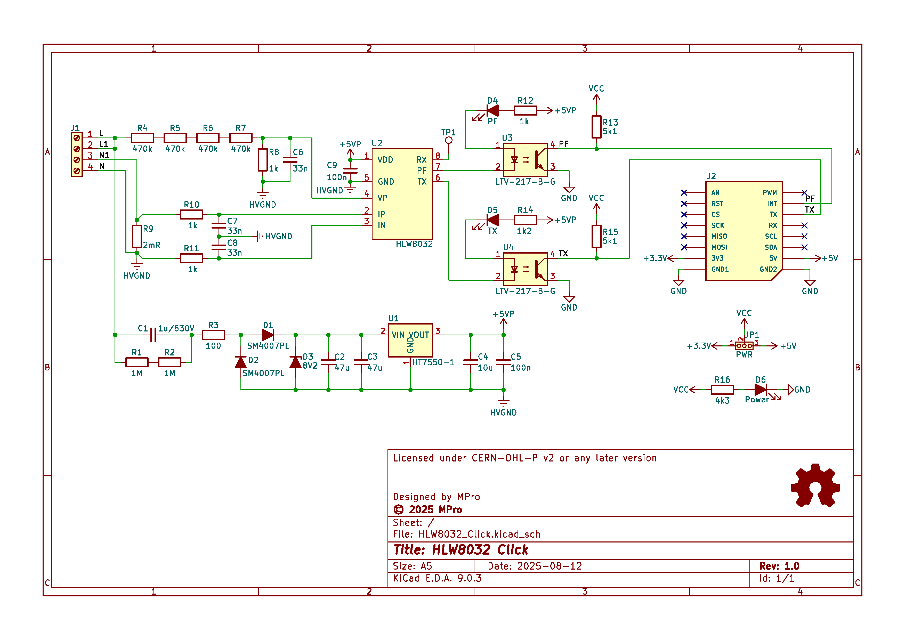
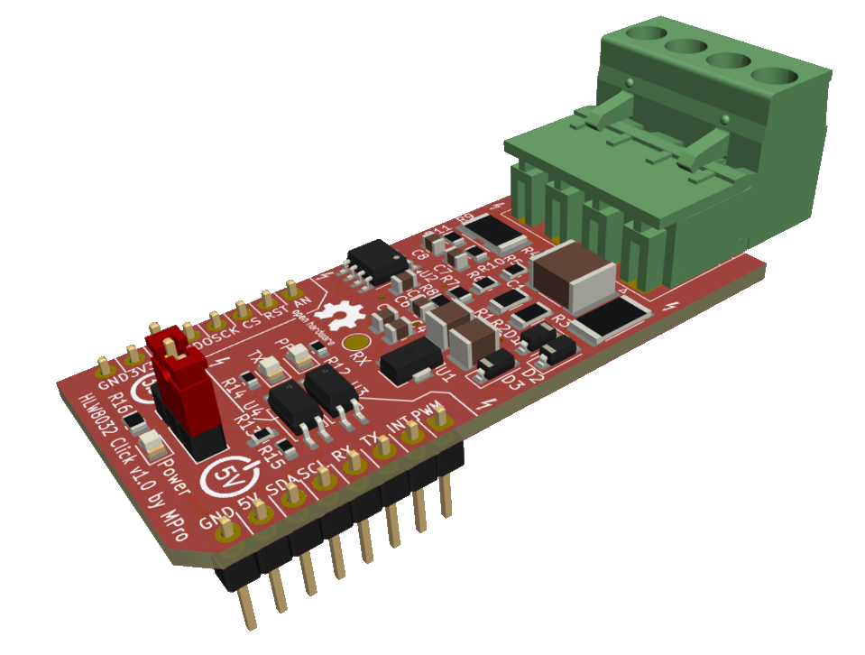

# **HLW8032 Click - energy metering module**

- [**HLW8032 Click - energy metering module**](#hlw8032-click---energy-metering-module)
  - [**Overview**](#overview)
    - [**Features**](#features)
  - [**Schematic diagram**](#schematic-diagram)
    - [**Visual simulation** of a transformerless power supply.](#visual-simulation-of-a-transformerless-power-supply)
  - [**Module visualisation**](#module-visualisation)
  - [**Assembly**](#assembly)
  - [**Production files**](#production-files)
  - [**Usage Guide**](#usage-guide)
  - [**Reporting bugs**](#reporting-bugs)
  - [**License**](#license)
  - [**Support**](#support)

---

## **Overview**
The HLW8032 Click board is a compact energy metering module designed for integration with MikroElektronika's mikroBUS™ ecosystem. It utilizes the HLW8032 integrated circuit, a high-precision single-phase energy measurement chip capable of monitoring active power, voltage, current, and power factor. This board is suitable for applications in smart energy monitoring, IoT-based power management systems, and industrial automation where accurate real-time energy consumption data is required.

### **Features**
* **Energy Metering IC**: [HLW8032](./docs/HLW8032_EN_Rev1.5.pdf) for precise measurement of voltage (VP), current (IP/IN), and power.
* **Input Connections**: 4-pin screw terminal for line (L), neutral (N), and load connections.
* **Shunt Resistor**: 2 mΩ for current sensing, rated for high power dissipation.
* **mikroBUS™ Compatibility**: Standard mikroBUS™ PCB form factor.
* **Ground Separation**: High-voltage ground (HVGND) isolated from low-voltage ground (GND) for safety.

The board supports UART communication at 4800 baud for serial data output, providing registers for power, voltage, current, and energy accumulation.

---

## **Schematic diagram**

### [**Visual simulation**](https://falstad.com/circuit/circuitjs.html?ctz=CQAgjCAMB0l3BWEAWATLBBOAzM5kxVJsAObbEBSSlChAUwFowwAoAJxCJPE1S5I8wfKOHjxWAZxAA2ZODzhUQxdWoAzAIYAbSfVYBjASvmETKKLHERUmMNCIISAdmQzbytM5DM1rAG6iqM781GAyauCU1B6iatAIHEpCIty8oWLikKwA7snp+WCqucYFyubZACYg2Aj8wfy1-EXyzQBy+JDIrNVNCvKd-VwglfRaAK7aAC6suCAkAGrN4NDORU0kwspg8KhM3jFWWceQJPIkDuCsAF4ocFwhd2GK-IuoJTGPfQ1QJYM-30e2U45SGfRaoh22TyCGcMiGCEIQ2hlDhD34iPqQL+yB4P3+2KMeHMxPRFhg4mQ3hkCVOyGwREImBIMlcEF8ljYeVJEMGEJRmLJpJ+2SMgohgvxlkp1NpcM2mEwTnpqCRHIFSN5uORrAAlqj4RK0SLpWBEgBlWSmVTI0RaXT0IIBHwkT78Riu8ARSGyZ6ReKJPIet1BbFBz3hajB-Io6NmSHKX4Ae2GcgTthsdgc+FQyERcmwmFZ0rsMjORTA2EgfBkCHIQWG2FYKdVVtE+EVYmlqCQNi4ECbpGGADEIPEsmOjjt2RAAMKaAAOmgMuqmmgAdgZ9EPqKOfdOfBAAEr0SS6yRrzf6IA) of a transformerless power supply.

## **Module visualisation**
(click on the image to see the 3D model)

## **Assembly**
[Interactive BOM and placement](https://michpro.github.io/mikroBUS/HLW8032_Click/docs/ibom.html)

## **Production files**
Production files can be found [**here**](./production/).

---

## **Usage Guide**

* **Connection**:
  * Connect AC line to J1 (L/N) and load to L1/N1.
  * Plug into mikroBUS™ socket on a host board (e.g., MCU development kit).
  * Power via +5V/+3.3V pins.
* **Communication**:
  * UART (TX/RX at 4800 baud, 8N1): Read 24-byte data frames for measurements.
  * PF Pin: Pulse output proportional to active electric energy.
* **Software**:
  * Use MikroE libraries or custom code to parse HLW8032 registers.
  * Example: Voltage = (Register Value) * Calibration Factor.
* **Calibration**: Adjust via software for shunt and divider ratios.
* **Safety**: ** *Handle high-voltage sections with care; ensure proper isolation* **.

---

## **Reporting bugs**

[Create an issue on GitHub](https://github.com/michpro/mikroBUS/issues)

---

## **License**
Copyright © 2025 Michal Protasowicki

This project is released under CERN Open Hardware Licence Version 2 - Permissive.

---

## **Support**
If You find my projects interesting and You wanted to support my work, You can give me a cup of coffee or a keg of beer :)

&nbsp;&nbsp;&nbsp;&nbsp;&nbsp;&nbsp;&nbsp;&nbsp;&nbsp;&nbsp;
