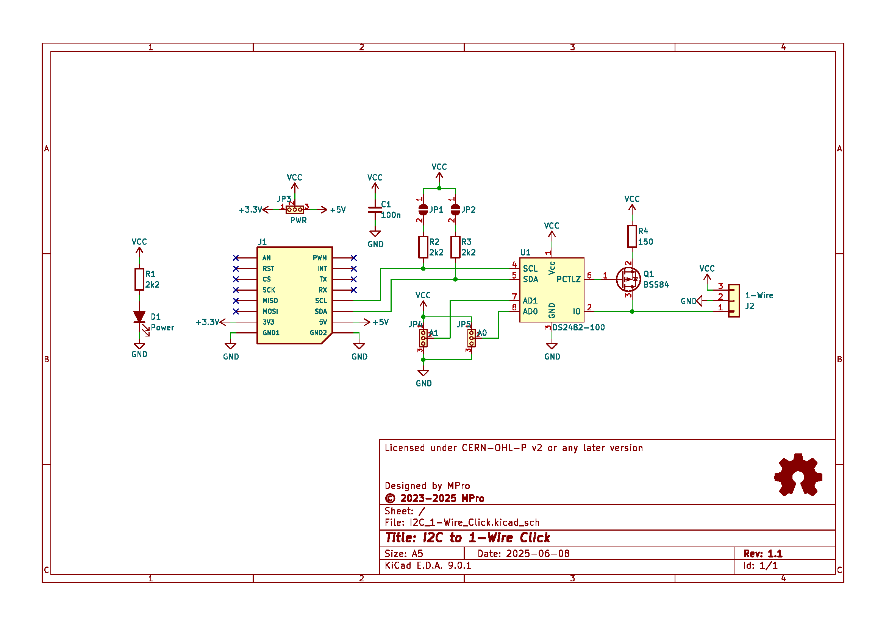
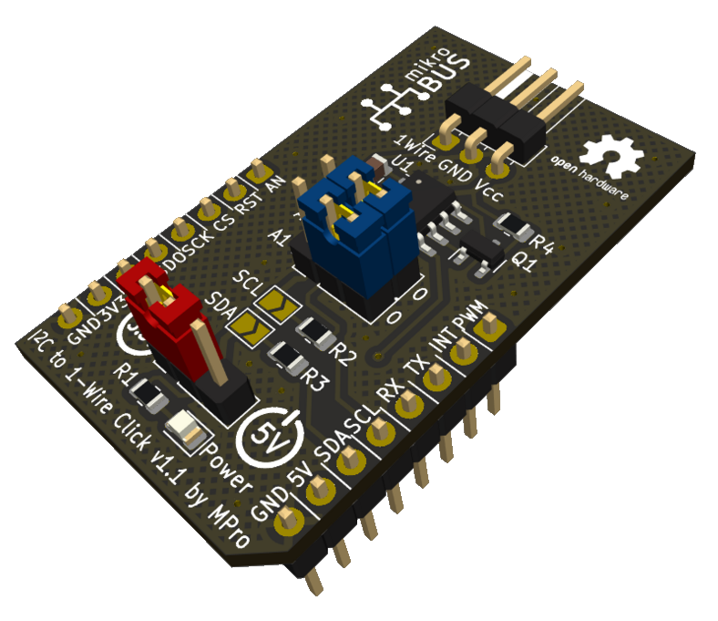

# **I²C to 1-Wire Click**

- [**I²C to 1-Wire Click**](#ic-to-1-wire-click)
  - [**Overview**](#overview)
    - [**Features**](#features)
  - [**Schematic diagram**](#schematic-diagram)
  - [**Module visualisation**](#module-visualisation)
  - [**Assembly**](#assembly)
  - [**Production files**](#production-files)
  - [**Configuration**](#configuration)
      - [**Note**](#note)
  - [**Reporting bugs**](#reporting-bugs)
  - [**License**](#license)
  - [**Support**](#support)

---

## **Overview**
The I²C to 1-Wire Click board is a compact module designed to enable communication between a microcontroller with an I²C interface and 1-Wire devices. Built around the DS2482-100 I²C to 1-Wire bridge IC from Analog Devices, this board simplifies the integration of 1-Wire devices into I²C-based systems. It adheres to the MikroBUS™ standard, ensuring compatibility with a wide range of host systems that support Click boards.

### **Features**
* **I²C to 1-Wire Conversion**: Utilizes the DS2482-100 chip for seamless protocol bridging.
* **MikroBUS™ Compatibility**: Equipped with a MikroBUS™ connector for easy integration into host systems.
* **1-Wire Interface**: Features a 3-pin connector for connecting 1-Wire devices.
* **Power LED**: Visual indicator for power status.
* **Flexible Power Supply**: Supports operation at both 3.3V and 5V.
* **Configurable Options**: Includes solder jumpers for I²C pull-up resistors and address selection.

---

## **Schematic diagram**

## **Module visualisation**
(click on the image to see the 3D model)

## **Assembly**
[Interactive BOM and placement](https://michpro.github.io/mikroBUS/I2C_1-Wire_Click/docs/ibom.html)

## **Production files**
Production files can be found [**here**](./production/).

## **Configuration**
The board offers solder jumpers for customization:
* **JP1**: Enables the 2.2kΩ pull-up resistor on SCL when closed (default: open).
* **JP2**: Enables the 2.2kΩ pull-up resistor on SDA when closed (default: open).
* **JP4, JP5**: Configure the I²C address of the DS2482-100 by connecting AD1 and AD0 to VCC or GND.

#### **Note**
To enable a pull-up feature (JP1, JP2), solder the jumper pads closed. Ensure the host system’s I²C bus requirements align with the configured settings (e.g., pull-up resistors may already exist on the host).

---

## **Reporting bugs**

[Create an issue on GitHub](https://github.com/michpro/mikroBUS/issues)

---

## **License**
Copyright © 2023-2025 Michal Protasowicki

This project is released under CERN Open Hardware Licence Version 2 - Permissive.

---

## **Support**
If You find my projects interesting and You wanted to support my work, You can give me a cup of coffee or a keg of beer :)

&nbsp;&nbsp;&nbsp;&nbsp;&nbsp;&nbsp;&nbsp;&nbsp;&nbsp;&nbsp;
