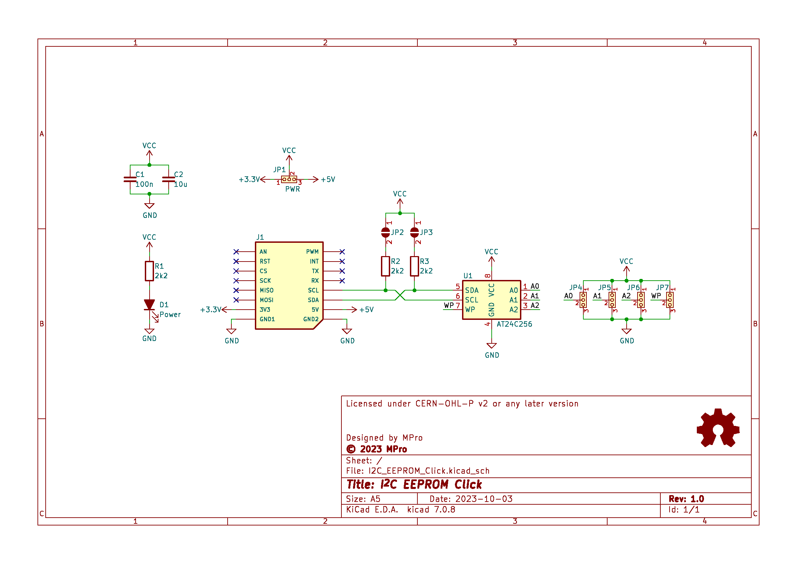
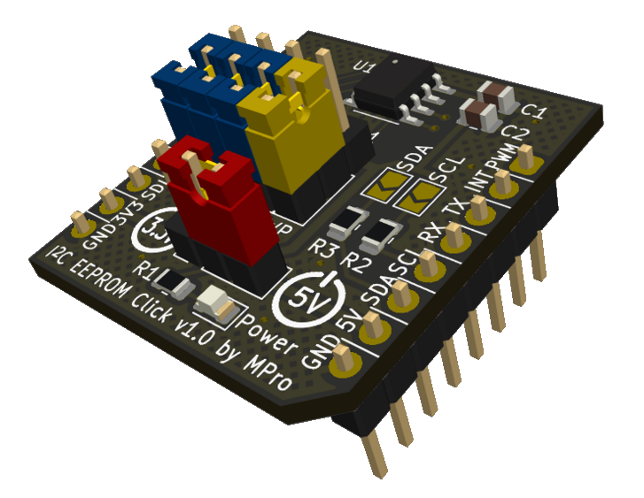

# **I²C EEPROM/FRAM Click**

- [**I²C EEPROM/FRAM Click**](#ic-eepromfram-click)
  - [**Overview**](#overview)
    - [**Features**](#features)
      - [**Note**](#note)
  - [**Schematic diagram**](#schematic-diagram)
  - [**Module visualisation**](#module-visualisation)
  - [**Assembly**](#assembly)
  - [**Production files**](#production-files)
  - [**Configuration**](#configuration)
      - [**Note**](#note-1)
  - [**Reporting bugs**](#reporting-bugs)
  - [**License**](#license)
  - [**Support**](#support)

---

## **Overview**
The I²C EEPROM/FRAM Click is a compact add-on board designed to provide 256 Kbit (32 Kbyte) of non-volatile memory storage using the I²C communication protocol. It is compatible with the mikroBUS™ standard, enabling seamless integration with a wide range of development boards. This board is ideal for applications requiring reliable data storage with a simple interface.

### **Features**
* **Memory**: 256 Kbit (32 Kbyte) I²C EEPROM ([AT24C256](https://ww1.microchip.com/downloads/en/DeviceDoc/doc0670.pdf)) or I²C FRAM ([FM24W256-G](https://www.infineon.com/assets/row/public/documents/10/49/infineon-fm24w256-256-kbit-32k-x-8-serial-i2c-f-ram-datasheet-en.pdf))
* **Interface**: I²C with selectable address (A0, A1, A2)
* **Write Protection**: Configurable write protection via jumper (WP)
* **Power Indicator**: Onboard LED for power status
* **Voltage Compatibility**: Supports 3.3V and 5V operation
* **Connector**: Standard mikroBUS™ socket

#### **Note**
* The use of FRAM memory provides extremely high endurance of 100 trillion (10¹⁴) read/write operations.
* Other memory chips may also be used, provided that they are compatible with the pin layout.

---

## **Schematic diagram**

## **Module visualisation**
(click on the image to see the 3D model)

## **Assembly**
[Interactive BOM and placement](https://michpro.github.io/mikroBUS/I2C_EEPROM_Click/docs/ibom.html)

## **Production files**
Production files can be found [**here**](./production/).

## **Configuration**
* **Power Selection (JP1)**:
  * **Position 1-2**: 3.3V
  * **Position 2-3**: 5V
* **I²C Address (JP4-JP6)**:
  * Each jumper sets one address bit (A0, A1, A2).
  * Connect to VCC for '1' or GND for '0'; combinations adjust the address per datasheet.
* **Write Protect (JP7)**:
  * Connect to VCC to enable write protection (disables writes).
  * Connect to GND to disable write protection (enables writes).
* **Solder Jumpers (JP2, JP3)**:
  * Enables the 2.2kΩ pull-up resistor on SDA and SCL when closed (default: open).

#### **Note**
For a pull-up feature (JP2, JP3) ensure the host system’s I²C bus requirements align with the configured settings (e.g., pull-up resistors may already exist on the host).

---

## **Reporting bugs**

[Create an issue on GitHub](https://github.com/michpro/mikroBUS/issues)

---

## **License**
Copyright © 2023-2025 Michal Protasowicki

This project is released under CERN Open Hardware Licence Version 2 - Permissive.

---

## **Support**
If You find my projects interesting and You wanted to support my work, You can give me a cup of coffee or a keg of beer :)

&nbsp;&nbsp;&nbsp;&nbsp;&nbsp;&nbsp;&nbsp;&nbsp;&nbsp;&nbsp;
