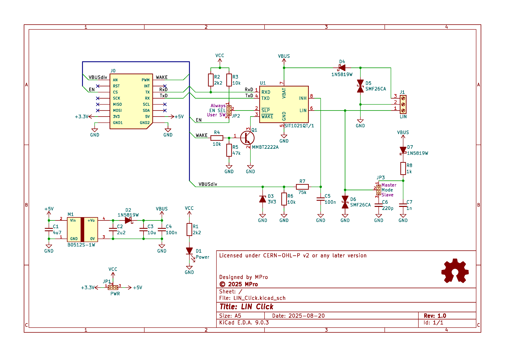
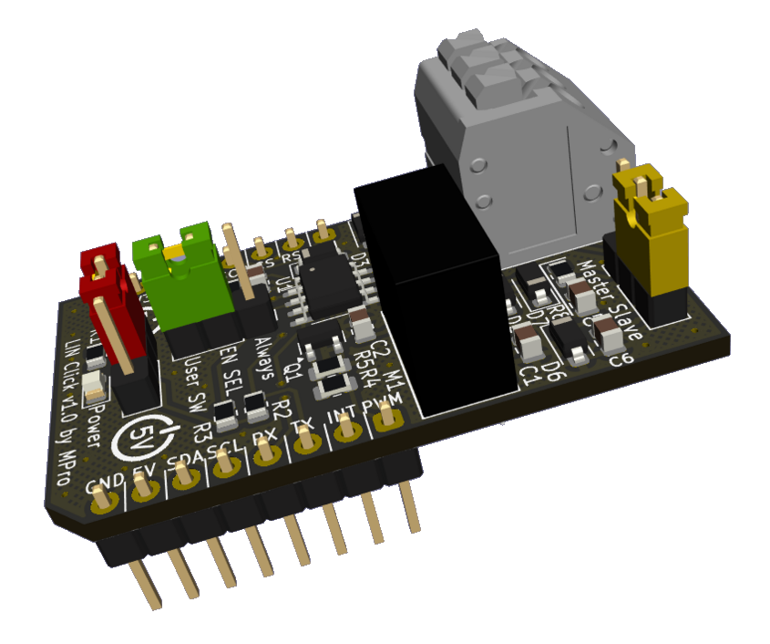

# **LIN Click**

- [**LIN Click**](#lin-click)
  - [**Overview**](#overview)
    - [**Features**](#features)
  - [**Schematic diagram**](#schematic-diagram)
  - [**Module visualisation**](#module-visualisation)
  - [**Assembly**](#assembly)
  - [**Production files**](#production-files)
  - [**Reporting bugs**](#reporting-bugs)
  - [**License**](#license)
  - [**Support**](#support)

---

## **Overview**
The LIN Click board is a compact module designed for Local Interconnect Network (LIN) bus communication. It is intended for use in automotive and industrial applications, providing a reliable interface for LIN protocol. The design is compatible with the mikroBUS™ Click board ecosystem, allowing easy integration with various development boards.

### **Features**
* LIN bus interface with spring terminal for easy connection
* 12V power supply using B0512S-1W DC-DC converter (5V to 12V)
* TVS protection for surge suppression
* Schottky diodes for reverse polarity protection

---

## **Schematic diagram**

## **Module visualisation**
(click on the image to see the 3D model)

## **Assembly**
[Interactive BOM and placement](https://michpro.github.io/mikroBUS/LIN_Click/docs/ibom.html)

## **Production files**
Production files can be found [**here**](./production/).

---

## **Reporting bugs**

[Create an issue on GitHub](https://github.com/michpro/mikroBUS/issues)

---

## **License**
Copyright © 2025 Michal Protasowicki

This project is released under CERN Open Hardware Licence Version 2 - Permissive.

---

## **Support**
If You find my projects interesting and You wanted to support my work, You can give me a cup of coffee or a keg of beer :)

&nbsp;&nbsp;&nbsp;&nbsp;&nbsp;&nbsp;&nbsp;&nbsp;&nbsp;&nbsp;
