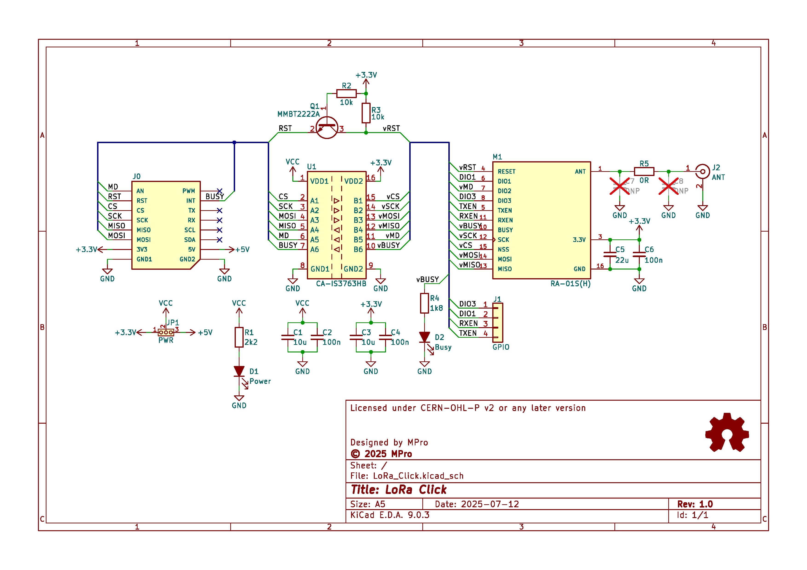
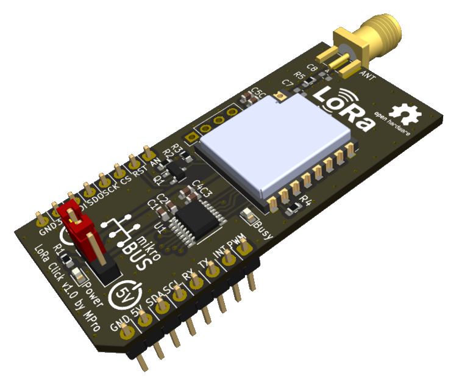

# **LoRa Click**

- [**LoRa Click**](#lora-click)
  - [**Overview**](#overview)
    - [**Features**](#features)
    - [**Transceivers:**](#transceivers)
  - [**Software**](#software)
  - [**Schematic diagram**](#schematic-diagram)
  - [**Module visualisation**](#module-visualisation)
  - [**Assembly**](#assembly)
  - [**Production files**](#production-files)
  - [**Reporting bugs**](#reporting-bugs)
  - [**License**](#license)
  - [**Support**](#support)

---

## **Overview**
The LoRa Click board is a compact add-on board designed to provide LoRa wireless communication capabilities. Built around the SX1262/SX1268 LoRa transceiver module from Semtech, it supports long-range, low-power wireless communication. The board interfaces with a host microcontroller via the MikroBUS™ standard, ensuring compatibility with a wide range of development platforms.

### **Features**
* **LoRa Transceiver**: Utilizes the SX1262 or SX1268 for reliable long-range communication.
* **Digital Isolation**: Incorporates the CA-IS3763HB digital isolator for safe and noise-immune SPI communication.
* **Antenna Connection**: Features an SMA connector for attaching an external antenna.
* **GPIO Access**: Provides access to additional pins like DIO1 and DIO3 for extended functionality.
* **Power Indicators**: Includes LEDs for visual power status indication.

### **Transceivers:**
* **SX1262**: [RA-01SH](./docs/ra-01sh_specification.pdf) from Ai-Thinker - frequency range: 803-930MHz
* **SX1268**: [RA-01S](./docs/ra-01s_specification.pdf) from Ai-Thinker - frequency range: 410-525MHz

---

## **Software**
Suggested library for Arduino: [https://github.com/nopnop2002/Arduino-LoRa-Ra01S](https://github.com/nopnop2002/Arduino-LoRa-Ra01S)

---

## **Schematic diagram**

## **Module visualisation**
(click on the image to see the 3D model)

## **Assembly**
[Interactive BOM and placement](https://michpro.github.io/mikroBUS/LoRa_Click/docs/ibom.html)

## **Production files**
Production files can be found [**here**](./production/).

---

## **Reporting bugs**

[Create an issue on GitHub](https://github.com/michpro/mikroBUS/issues)

---

## **License**
Copyright © 2025 Michal Protasowicki

This project is released under CERN Open Hardware Licence Version 2 - Permissive.

---

## **Support**
If You find my projects interesting and You wanted to support my work, You can give me a cup of coffee or a keg of beer :)

&nbsp;&nbsp;&nbsp;&nbsp;&nbsp;&nbsp;&nbsp;&nbsp;&nbsp;&nbsp;
