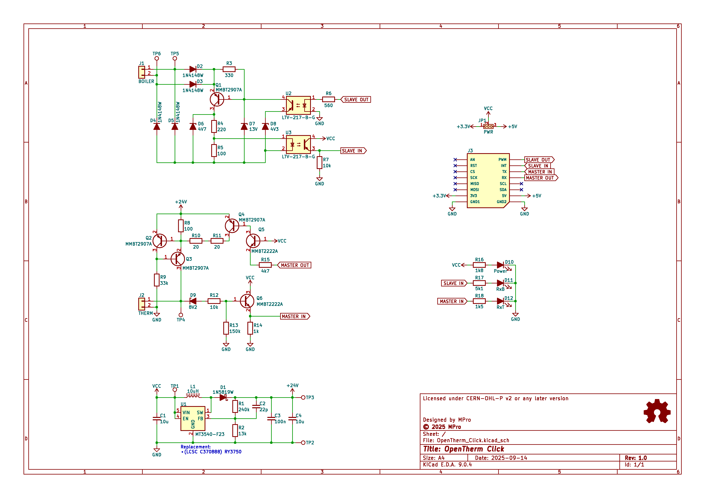
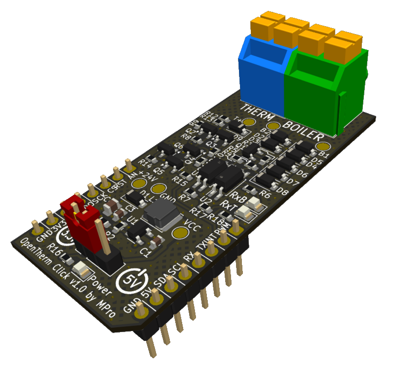

# **OpenTherm Click**

- [**OpenTherm Click**](#opentherm-click)
  - [**Overview**](#overview)
    - [**Features**](#features)
  - [**Schematic diagram**](#schematic-diagram)
  - [**Module visualisation**](#module-visualisation)
  - [**Assembly**](#assembly)
  - [**Production files**](#production-files)
  - [**Testing out the hardware**](#testing-out-the-hardware)
    - [Prerequisites](#prerequisites)
    - [Instructions](#instructions)
    - [Notes](#notes)
  - [**Software**](#software)
  - [**Reporting bugs**](#reporting-bugs)
  - [**License**](#license)
    - [**Hardware**](#hardware)
    - [**Software**](#software-1)
  - [**Support**](#support)

---

## **Overview**
The OpenTherm Click is a compact module designed to interface with OpenTherm-compatible heating systems, such as boilers and thermostats. It facilitates communication using the OpenTherm protocol, incorporating electrical isolation for safety and compatibility.

### **Features**
* OpenTherm slave interface to communicate with a boiler
* OpenTherm master interface to communicate with a thermostat
* can implement master, slave and gateway modes
* built-in (3.3-5V) to 24V DC-DC step up converter
* Compact Design - optimized for integration with microcontroller systems, such as mikroBUS™ Click boards.

This work is based on [otgw.tclcode.com](https://otgw.tclcode.com) project.

---

## **Schematic diagram**
<p align="center"></p>


## **Module visualisation**
(click on the image to see the 3D model)
<p align="center"><a href="https://3dviewer.net/#model=https://github.com/michpro/mikroBUS/blob/master/OpenTherm_Click/docs/OpenTherm_Click.wrl"></a></p>

## **Assembly**
[Interactive BOM and placement](https://michpro.github.io/mikroBUS/OpenTherm_Click/docs/ibom.html)

## **Production files**
Production files can be found [**here**](./production/).

---
## **Testing out the hardware**
Below are the start-up instructions for the [click_test.ino](./software/click_test/click_test.ino) Arduino program, a diagnostic tool designed to test and validate the electrical and communication integrity between a boiler and thermostat circuits on the OpenTherm Click. These instructions guide you through the process step-by-step, ensuring you can verify your hardware setup correctly.

### Prerequisites
- **OpenTherm Click**: Ensure it is properly connected to base µC module.
- **Computer**: Equipped with Arduino IDE or a serial monitor software.
- **Multimeter**: Required for measuring voltages and currents.
- **Two Wires**: Needed to connect the BOILER and THERM terminals during testing.

### Instructions

1. **Upload the Program**
   - Load the [click_test.ino](./software/click_test/click_test.ino) program onto your Arduino board using the Arduino IDE.<br>
    *If necessary, adjust the pins used in the programme.*

2. **Open Serial Monitor**
   - Launch the serial monitor in the Arduino IDE or your preferred serial terminal software.
   - Set the baud rate to **115200**.

3. **Initial Setup**
   - Disconnect the 'THERM' and 'BOILER' terminals from each other if they are connected.
   - Check the LEDs on the Click:
     - **'PWR'** and **'RxT'** LEDs should be lit.
     - **'RxB'** LED should be off.
   - The serial monitor will display a prompt. If the LED statuses match, type **`y`** and press Enter to proceed.

4. **Voltage Measurement 1**
   - Use a multimeter to measure the voltage between the **+24V test point** and **GND**.
   - Expected range: **23.5V to 24.5V**.
   - If within range, type **`y`** in the serial monitor to proceed.

5. **Voltage Measurement 2**
   - Measure the voltage between the **T+ test point** and **GND**.
   - Expected value: Approximately **24V**.
   - If correct, type **`y`** to proceed.

6. **Current Measurement 1**
   - Measure the current flowing between **T+** and **GND**.
   - Expected range: **5mA to 9mA**.
   - Verify that the **RxT LED** is **not lit** during this measurement.
   - If correct, type **`y`** to proceed.

7. **Activate MASTER-OUT and Current Measurement 2**
   - The program will activate the 'MASTER-OUT' line (you’ll see a message in the serial monitor).
   - Measure the current between **T+** and **GND** again.
   - Expected range: **17mA to 23mA**.
   - Ensure the **RxT LED** remains **not lit**.
   - If correct, type **`y`** to proceed.

8. **Connect Terminals and Voltage Measurement 3**
   - Connect the **BOILER** and **THERM** terminals using two wires (polarity does not matter).
   - Measure the voltage between test points **B1** and **B2**.
   - Expected range: **15V to 18V**.
   - If within range, type **`y`** to proceed.

9. **Check RxB LED**
   - The program will activate 'MASTER-OUT' again.
   - Observe the **'RxB' LED**; it should **light up**.
   - If it does, type **`y`** to proceed.

10. **Activate SLAVE-OUT and Voltage Measurement 4**
    - The program will activate the 'SLAVE-OUT' line.
    - Check that the **RxT LED** **stops lighting up**.
    - Measure the voltage between **B1** and **B2** again.
    - Expected range: **5V to 7V**.
    - If correct, type **`y`** to proceed.

11. **Test Result**
    - If all steps are completed successfully, the serial monitor will display:
      ```
      *****************
      *  TEST PASSED  *
      *****************
      ```
    - If any step fails, it will show:
      ```
      *****************
      * TEST FAIL !!! *
      *****************
      ```

12. **Continuous Testing (if passed)**
    - If the test passes, the program will enter a continuous testing mode.
    - It will repeatedly check communication between the boiler and thermostat, printing:
      - **"Boiler inbound, thermostat outbound ... OK"** or **"Failed"** with a reason.
      - **"Boiler outbound, thermostat inbound ... OK"** or **"Failed"** with a reason.

### Notes
- **Test Points and LEDs**: Ensure you correctly identify the test points (+24V, T+, GND, B1, B2) and LEDs (PWR, RxT, RxB) on the OpenTherm Click.
- **Safety**: Exercise caution when measuring voltages and currents to avoid short circuits.
- **Troubleshooting**: If a measurement falls outside the expected range:
  - Double-check your connections and multimeter settings.
  - Retry the step. Persistent issues may indicate a problem with the Click or setup.

<br>

***Follow these instructions carefully to test and validate your OpenTherm Click setup. Each step requires confirmation via the serial monitor, so keep it open and active throughout the process. Successful completion ensures your boiler and thermostat circuits are functioning correctly.***

---

## **Software**
- Recommended library for use in your OpenTherm projects: 
  [https://github.com/ihormelnyk/opentherm_library](https://github.com/ihormelnyk/opentherm_library)

---

## **Reporting bugs**

[Create an issue on GitHub](https://github.com/michpro/mikroBUS/issues)

---

## **License**
Copyright © 2025 Michal Protasowicki

### **Hardware**
  * Hardware part of this project is released under CERN Open Hardware Licence Version 2 - Permissive.

    [](../LICENSE)

### **Software**
  * Software part of this project is released under MIT Licence.

    [](./software/click_test/LICENSE)

---

## **Support**
If You find my projects interesting and You wanted to support my work, You can give me a cup of coffee or a keg of beer :)

[](https://www.paypal.me/michpro)&nbsp;&nbsp;&nbsp;&nbsp;&nbsp;[](https://ko-fi.com/F1F24CEW1)&nbsp;&nbsp;&nbsp;&nbsp;&nbsp;[](https://commerce.coinbase.com/checkout/ec299320-cbed-475d-976e-fdf37c1ac3d0)
