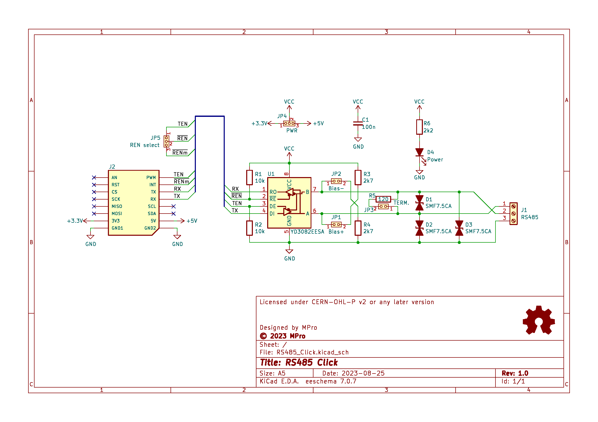
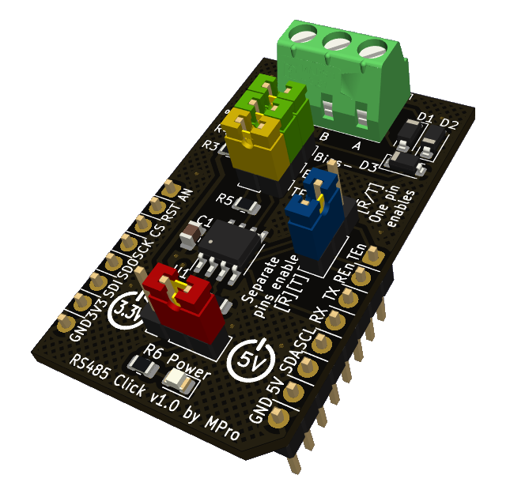

# **RS485 Click**

- [**RS485 Click**](#rs485-click)
  - [**Overview**](#overview)
    - [**Features**](#features)
  - [**Schematic diagram**](#schematic-diagram)
  - [**Module visualisation**](#module-visualisation)
  - [**Assembly**](#assembly)
  - [**Production files**](#production-files)
  - [**Usage Instructions**](#usage-instructions)
    - [**1. Power Supply Selection**:](#1-power-supply-selection)
    - [**2. Jumper Configurations**:](#2-jumper-configurations)
    - [**3. Microcontroller Connection**:](#3-microcontroller-connection)
    - [**4. Software Configuration**:](#4-software-configuration)
    - [**5. LED Indicator**:](#5-led-indicator)
  - [**Reporting bugs**](#reporting-bugs)
  - [**License**](#license)
  - [**Support**](#support)

---

## **Overview**
The RS485 Click is a compact add-on board designed for RS485 communication, enabling reliable serial data transmission over long distances. It features the YD3082EESA RS485 transceiver chip and is compatible with the MikroBUS™ click board standard, making it suitable for integration with various microcontroller-based systems.

### **Features**
* RS485 communication interface via the YD3082EESA transceiver
* Supports +3.3V and +5V power supplies, selectable via jumper
* Jumper-configurable control signals for operational flexibility
* TVS diodes for protection against voltage spikes on the RS485 bus
* LED power indicator
* Compact design adhering to the click board standard

---

## **Schematic diagram**

## **Module visualisation**
(click on the image to see the 3D model)

## **Assembly**
[Interactive BOM and placement](https://michpro.github.io/mikroBUS/RS485_Click/docs/ibom.html)

## **Production files**
Production files can be found [**here**](./production/).

---

## **Usage Instructions**
### **1. Power Supply Selection**:
* Configure jumper JP4:
  * Pins 1-2: +3.3V operation
  * Pins 2-3: +5V operation
### **2. Jumper Configurations**:
* JP1 (Bias+): Close to enable pull-up on A line.
* JP2 (Bias-): Close to enable pull-down on B line.
* JP3 (Term): Close to enable 120Ω termination.
* JP5 (REN select): Set to configure Receiver Enable source.
### **3. Microcontroller Connection**:
* Connect via the click board interface, mapping RO, DI, DE, and RE to the microcontroller’s UART and I/O pins.
### **4. Software Configuration**:
* Implement RS485 half-duplex communication, managing DE and RE signals:
  * DE high to transmit, low to receive.
  * RE can mirror DE or be controlled separately (JP5).
### **5. LED Indicator**:
* D4 illuminates when the board is powered.

---

## **Reporting bugs**

[Create an issue on GitHub](https://github.com/michpro/mikroBUS/issues)

---

## **License**
Copyright © 2023-2025 Michal Protasowicki

This project is released under CERN Open Hardware Licence Version 2 - Permissive.

---

## **Support**
If You find my projects interesting and You wanted to support my work, You can give me a cup of coffee or a keg of beer :)

&nbsp;&nbsp;&nbsp;&nbsp;&nbsp;&nbsp;&nbsp;&nbsp;&nbsp;&nbsp;
