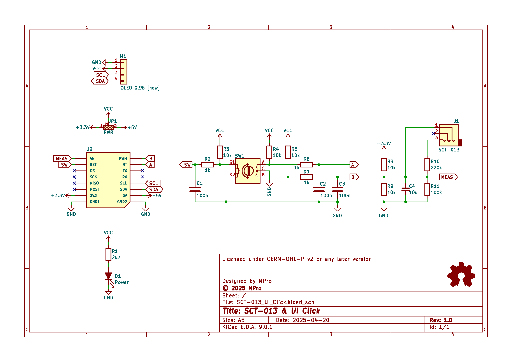
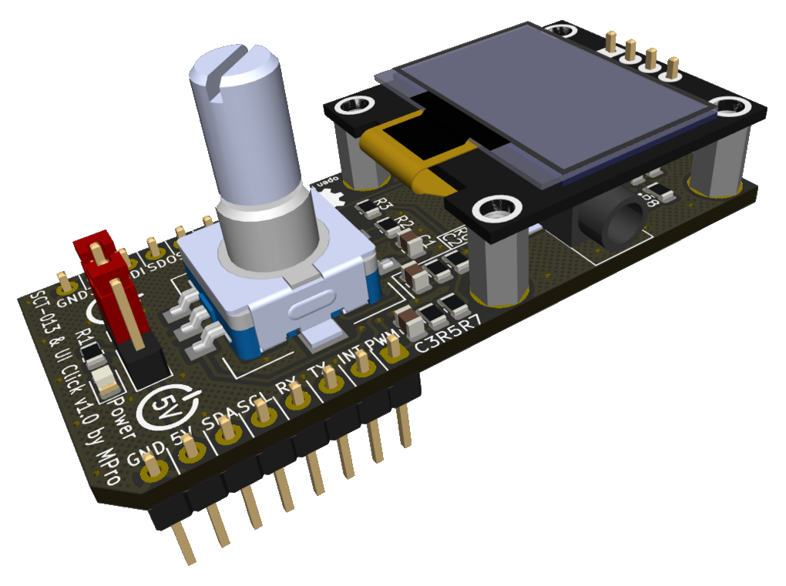

# **UI Click with SCT-013 interface**

- [**UI Click with SCT-013 interface**](#ui-click-with-sct-013-interface)
  - [**Overview**](#overview)
    - [**Features**](#features)
  - [**SCT-013 interface**](#sct-013-interface)
      - [**Note**](#note)
      - [**Visual simulation**](#visual-simulation)
  - [**Schematic diagram**](#schematic-diagram)
  - [**Module visualisation**](#module-visualisation)
  - [**Assembly**](#assembly)
  - [**Production files**](#production-files)
  - [**Reporting bugs**](#reporting-bugs)
  - [**License**](#license)
  - [**Support**](#support)

---

## **Overview**
The UI Click with SCT-013 interface is an open-hardware project designed to interface with the SCT-013 non-invasive current transformer sensor. It incorporates a user interface featuring a 0.96-inch I²C OLED display and a rotary encoder with an integrated switch for user interaction. This project supports both 3.3V and 5V power rails and includes an LED for power indication.

### **Features**
* **Sensor Interface**: Connects to the SCT-013 current transformer via a 3-pole audio jack.
* **Display**: Utilizes a 0.96-inch I2C OLED display for visual feedback.
* **User Input**: Features a rotary encoder with a push switch for navigation and control.
* **Power Supply**: Operates on 3.3V and 5V power rails.
* **Indicator**: Includes a yellow LED for power indication.

---

## **SCT-013 interface**
The circuit is designed for transducers with a voltage output of 1V. The signal from SCT-013 with an effective amplitude ranging from -1.42V to +1.42V is processed in the R8, R9, R10, R11 circuit into a useful signal ranging from 0 to 1V, which is then converted by the microcontroller ADC converter into digital form.
#### **Note**
* If an output voltage in the range of 0 to 3.3V is required, resistor R10 must be replaced with a 0Ω jumper and resistor R11 must be removed from the PCB.
#### [**Visual simulation**](https://falstad.com/circuit/circuitjs.html?ctz=CQAgjCAMB0l3BWcMBMcUHYMGZIA4UA2ATmIxAUgpABZsKBTAWjDACgAncMFEFFGt17FCUZPDYB3ISBG08s0ZDYBjcISrYEvMBr4DaUWPEikz5i6RAtohAQmLZiBQhhpgavKsoBu8kFq8NApy3rSa0PRhMAicMoEy-IJUYCZSiQa6VElQ6cEB2vGFytKsvAlZBV5sAOb+CfnYhArebH6VOSgIojkpFCnQnmLe0LFcXT14ChP6yfpp491VfEsoU2KpaaV6CTMJygAO1rqKx6IJURsmEkfYaHzrd5qFlynXcOkzawpPDy2fSwu9326RYojk+VCoJODR+xTYRzovG+tDuy1e4muAJ6BiRs1y0jxOSJ6xKqPKL2B8IA9nwUkpwPxiBBsLA6IQaMEwI5NsQvMZIBAqIJgeAkCkkNg2NhpiAAGJCozXIUC1IQFggADCAEMDtqVABLAAu2oAdioGNKWvLFRA1ccQAAlBgAZwNLpN5stQA)

---

## **Schematic diagram**

## **Module visualisation**
(click on the image to see the 3D model)

## **Assembly**
[Interactive BOM and placement](https://michpro.github.io/mikroBUS/SCT-013_UI_Click/docs/ibom.html)

## **Production files**
Production files can be found [**here**](./production/).

---

## **Reporting bugs**

[Create an issue on GitHub](https://github.com/michpro/mikroBUS/issues)

---

## **License**
Copyright © 2025 Michal Protasowicki

This project is released under CERN Open Hardware Licence Version 2 - Permissive.

---

## **Support**
If You find my projects interesting and You wanted to support my work, You can give me a cup of coffee or a keg of beer :)

&nbsp;&nbsp;&nbsp;&nbsp;&nbsp;&nbsp;&nbsp;&nbsp;&nbsp;&nbsp;
